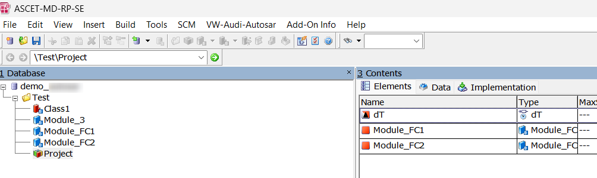
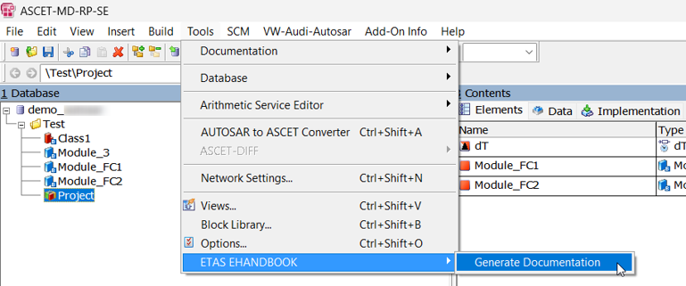
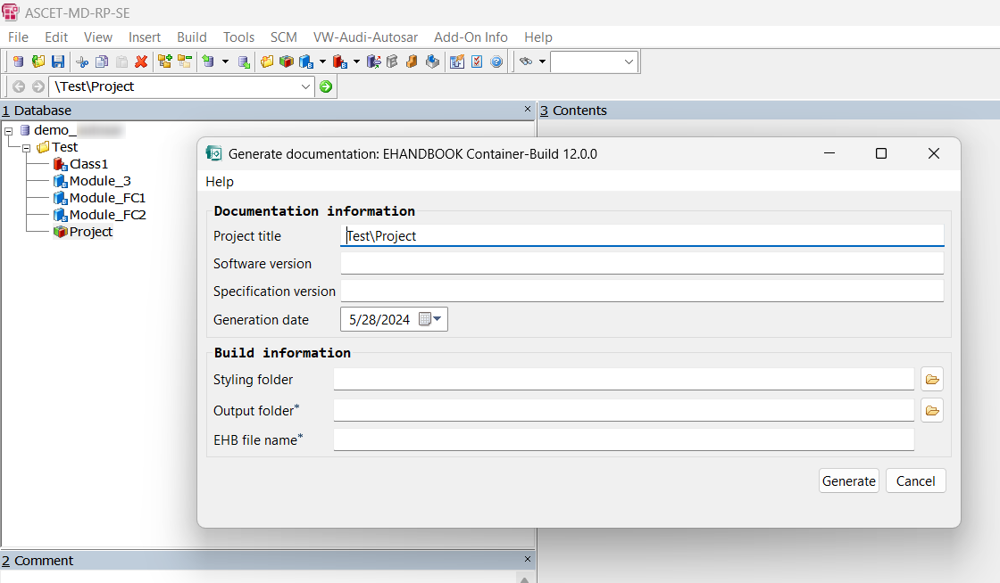
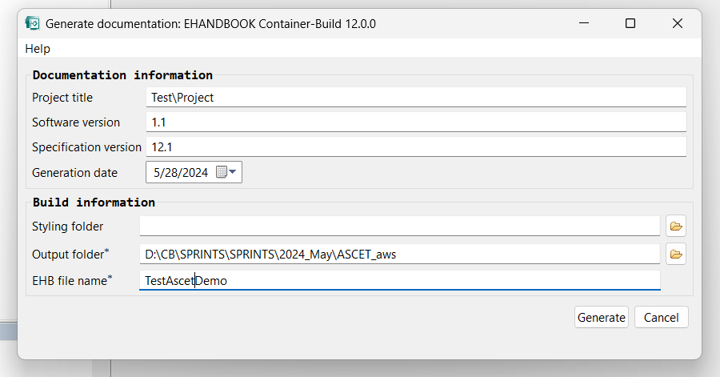
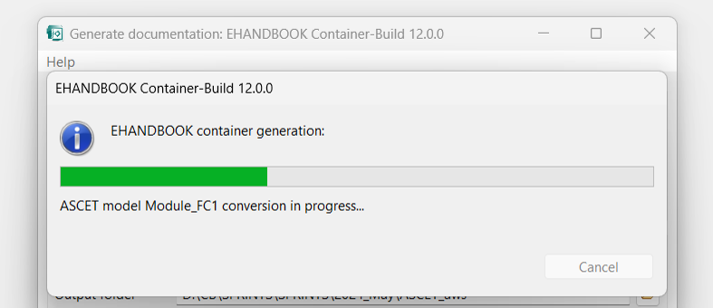
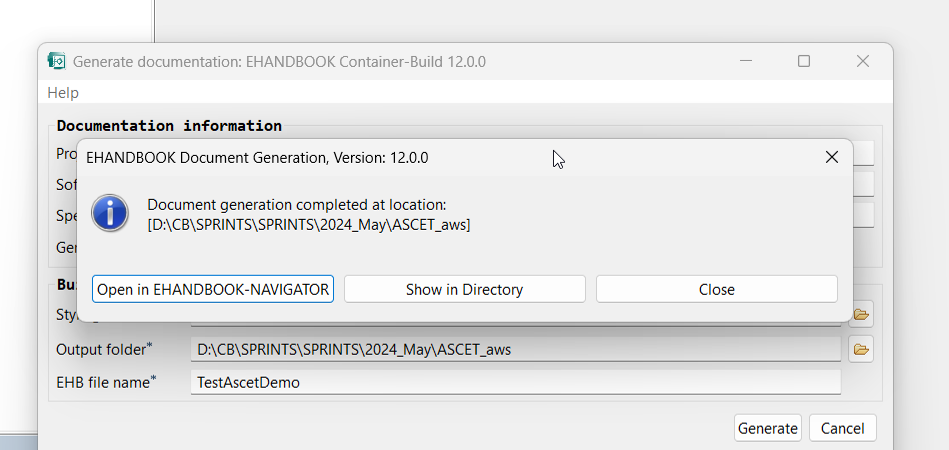
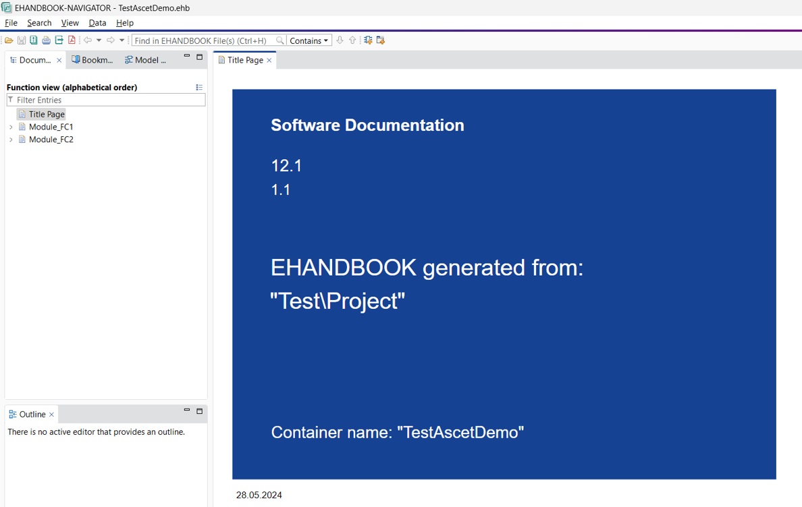

# Demo: EHB-CB Toolbox for ASCET

**Objective:** This demo shows how to use the EHANDBOOK Container-Build (EHB-CB) ASCET toolbox add-on to generate an EHANDBOOK container from an ASCET project (.axl).

---

## ✨ Features Showcased

* ASCET toolbox integration (Generate Documentation via Tools → ETAS EHANDBOOK)
* Generation of EHANDBOOK Container (.ehb) directly from an ASCET project file
* Selective processing of referenced modules only (ASCET project awareness)

---

## 🛠️ Prerequisites

* ASCET 6 (version compatible with the installed ETAS EHANDBOOK toolbox)
* The demo includes an example AXL file (`TestInput.axl`) to import into ASCET

---

## 🛠️ How to Run (Quick Steps)

1. Open ASCET 6 and import the example AXL file: `TestInput.axl` (or use your own project file).
2. Select the ASCET project you want to document.
3. From the ASCET main menu choose **Tools → ETAS EHANDBOOK → Generate Documentation**.
4. In the dialog, enter the EHANDBOOK Container details (title, version, output folder) and press **Generate**.
5. Wait for the generation to complete. The EHB-CB toolbox shows progress and a completion dialog when finished.
6. Inspect the generated `.ehb` file in the demo's `Output/` folder or open it in EHANDBOOK-NAVIGATOR.

---

## Step-by-step (screenshots)

### 1) Import the AXL file

### 2) Launch EHANDBOOK container generation

Choose the ASCET project to be processed. Open **Tools** from main menu, select **ETAS EHANDBOOK** and choose **Generate Documentation**.

### 3) Enter details

In the dialog, enter the details for the EHANDBOOK Container to be generated.

### 4) Start generation

After entering all necessary details, press **Generate**.

### 5) Generation progress and completion

During the generation process, a progress bar is shown on the screen.

After the EHANDBOOK container is generated you will see the completion dialog:

### 6) Inspect the EHANDBOOK container in EHANDBOOK-NAVIGATOR

---

## 🔬 Explore the Output

* After a successful run, the generated EHANDBOOK Container file will be placed in the `Output` folder of this demo.
* Open the `.ehb` file with EHANDBOOK-NAVIGATOR to browse the generated documentation and ensure expected modules and functions are present.

---

## ⚙️ Under the Hood

### Directory structure (what to expect in this demo)

* `TestInput.axl` — example ASCET project file included for import
* `Output/` — generated EHB-CB outputs, including `.ehb` container file
* Images (`step1_... .png`, ...) — screenshots used in this README

This demo is executed from within ASCET via the installed toolbox and therefore does not include an automated `build.bat` script.

### Behavior notes

* Only modules that are referenced by the selected ASCET project are processed and documented. Unreferenced modules (e.g., example `Module_3` in the sample project) will not appear in the generated EHANDBOOK container.

---

## ❗ Troubleshooting

* If the **ETAS EHANDBOOK** entry is missing under **Tools**, confirm that the toolbox is installed properly.
* If the generated `.ehb` file is not in `Output` directory, check the dialog's configured output folder and verify write permissions.
* For unexpected missing functions, verify that the modules are referenced in the ASCET project and that all source paths are correct.

---

## Important

Only modules which are referred in the selected ASCET Project are processed by EHANDBOOK generation from ASCET. Hence, function entries are created only for these referred modules.

In the example, Module_3 is not referred inside the ASCET Project `Test`. Consequently, it does not appear in the generated EHANDBOOK container.
