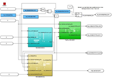

= Function Documentation

== Function Overview

Lambda Correction Calculation

Here comes a function diagram:

ehbfunctionoverview::Function1[Function1 Overview Diagram]

The function name provided here are the function component folder name which will have the metadata excel file. 

== Static Image

This is a sample for a static image without any model linkage:

image::staticImage.png[]

== Interactive Model Linking

EHB offers a linking mechanism between model figures inside adoc documents and their respective model hierarchy within the functional component (FC) in both directions. The model figure is shown with a button “Open interactive model” in the text pane. By click on it, the corresponding model hierarchy is opened in the model explorer. Here the pop-up menu “Show in Documentation” navigates you back to the model figure in the text pane.

=== Model Linking with Embedded Images

In this case, the a pre-generated figure is used for the adoc document. To invoke the linkage, the following syntax in the adoc has to be used and this static image is shown later, and a link to the interactive model is created:

=== Model linking with images generated by EHB-CB

In this case, the model figure is generated by EHB-CB out of the interactive model and placed into the EHB-NAV text pane from the adoc content.

ehbmodelref::Lcc/Main_Block[Lcc/Main_Block]

A deeper hierarchy model path will look like this:

ehbmodelref::Lcc/Main_Block/Two-point-controller[Lcc/Main_Block/Two-point-controller]

== Auto-Tagging

In addition, EHB allows to tag all know variables and parameters from the xls files. E.g. Stc_flgFuelCorrActive or Lcc_EngSpd2facIntegrator_CUR are marked and will open the label-popup in NAV later to show more information about it.

