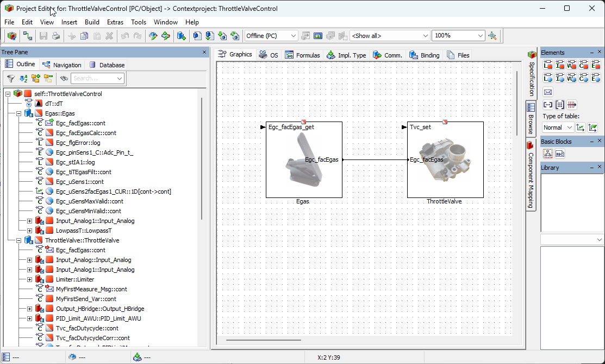

# Demo: Directory-Based EHANDBOOK Container-Build for an ASCET Model

**Objective:** This demo shows how to set up a directory-based EHANDBOOK Container-Build for an ASCET project (`.axl`).

---

## ✨ Features Showcased

*   Demonstrates, using an ASCET 6 example, what the directory structure for a directory-based build should look like.
*   Generates an EHANDBOOK Container (`.ehb`) from the specified directory structure.

---

## 📖 Understanding the Directory Structure

### The Required Structure

The directory-based EHANDBOOK Container-Build expects a specific directory structure, with one subfolder for each documentation unit. Each of these subfolders must contain at least:

1.  An ASCET model file (`.axl`)
2.  Textual documentation (`.adoc`)
3.  Interface and label descriptions (label and parameter lists) as an Excel file (`.xlsx`)

**Example Structure:**

```
<root>/
├── Functional_Component_1/  (Documentation Unit 1)
│   ├── model.axl
│   ├── documentation.adoc
│   └── labels.xlsx
│
└── Functional_Component_2/  (Documentation Unit 2)
    ├── model.axl
    ├── documentation.adoc
    └── labels.xlsx
```

### Partitioning the ASCET Model into Documentation Units

Typically, the input is a single ASCET model file (`.axl`) exported from a project, which contains all referenced components.

**ASCET Project Structure:**

*   **ASCET Project**
    *   **ASCET Module**
        *   ASCET Class
        *   ASCET Class
            *   ASCET Class
    *   **ASCET Module**
    *   ...

Each ASCET module usually represents one functional component, which in turn corresponds to one documentation unit in the EHANDBOOK.

### Splitting the Project Model File

The main ASCET project model file must be split into several smaller `.axl` files, where each file contains one module and its referenced components. This can be done manually (an `.axl` file is a ZIP archive) or with a script.

### Creating Label and Parameter Lists

Every element in the ASCET module and its referenced components must be listed in the label and parameter list file (`.xlsx`) to be visible in the EHANDBOOK Navigator. The list should be differentiated by parameters and other elements, and enriched with information such as direction (input/output/local), data type, and description.

### Creating Initial Textual Documentation

It is helpful to create an initial textual description (`.adoc` file) that contains model links to the ASCET diagrams and hierarchies within the functional component.

---

## 🚀 Practical Example: ThrottleValveControl

A script can automate the steps described in the previous chapter. While the script itself is not shared here, its outcome is demonstrated below.

### Demo Model: ThrottleValveControl

The demo uses an ASCET project containing two ASCET modules: `Egas` and `ThrottleValve`.



### Input Directory Structure

The required directory structure is created in the `ThrottleValveControl_ehbcb_in/` folder:

```
ThrottleValveControl_ehbcb_in/
├── Egas/
│   ├── Egas.adoc
│   ├── Egas.axl
│   └── Egas.xlsx
│
└── ThrottleValve/
    ├── ThrottleValve.adoc
    ├── ThrottleValve.axl
    └── ThrottleValve.xlsx
```

You can examine these files to get a better understanding of the structure and content.

### Building the EHANDBOOK Container

To build the container, run the `build.bat` script, which executes the following command:

```batch
eHandbookCB.exe ^
  -i "ThrottleValveControl_ehbcb_in" ^
  -o "ThrottleValveControl_ehbcb_out" ^
  -n "ThrottleValveControl" ^
  -gensvg ^
  -includeSourceCode ^
  -labelconfig "labelconfig.json"
```

This command tells `eHandbookCB.exe` to:
*   Use the `ThrottleValveControl_ehbcb_in/` directory as the input source (`-i`).
*   Place the generated container in the `ThrottleValveControl_ehbcb_out/` directory (`-o`).
*   Name the container `ThrottleValveControl` (`-n`).
*   Generate SVG graphics for the models (`-gensvg`).
*   Include any ESDL source code from the ASCET model (`-includeSourceCode`).
*   Load the `labelconfig.json` file to configure the order of ASCET instance names (`-labelconfig`).


