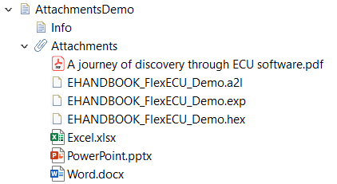

= Info

EHANDBOOK Containers can contain additional files which are attached to individual chapters.
Through this, additional information can be propvided to EHANDBOOK users in a structured and organized way.

For a given documentation chapter, the corresponding attachments can be found in the subsection "Attachments" in the table of contents (Document Explorer tab).

You can open an attachment by clicking its entry in the Document Explorer. 
Attachments are opened outside of EHANDBOOK-NAVIGATOR with the standard application that is associated by Microsoft Windows for the given file type. 

This chapter provides a set of example attachments. You can try out how to open or save an attachment. 

Note:

* Attachments are introduced with EHANDBOOK 10.0
* To work with EHB Containers that have attachments, EHANDBOOK-NAVIGATOR 10.0 or newer is required

