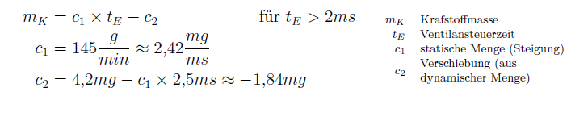

ehbfunctionoverview::CPT_Itc[Component Overview for CPT_Itc]

ehbmodelref::InjectionTime/Main[InjectionTime/Main]

== Einspritzzeit

Im Modul Einspritzzeit (InjectionTime) wird die Kraftstoffmasse Fmc_mFuel in die Ein- -spritzzeit Itc_tiInj gewandelt, evaluiert, ob eine Einspritzung Itc_flgInjCutoff = true stattfinden muss und die batteriespannungsabhängige Verzugszeit Itc_tiBattDelay der Einspritzdüsen berechnet. Nach dem vollständigen Öffnen und vor dem Schließbeginn des Einspritzventils besteht ein linearer Zusammenhang zwischen der eingespritzten Kraftstoff- menge und der Öffnungszeit. Die Geradengleichung (s. Gleichung 5.11) entsteht durch eine statische und eine dynamische Menge. Zur Berechnung der Einspritzzeit aus der Kraft- stoffmenge ist die Umkehrfunktion ist in der Kennlinie Itc_mFuelMass2tiInjBase_CUR hinterlegt.

Während des Öffnens ist das Verhältnis nicht linear und muss bei Bedarf durch Versuche ermittelt werden. Die Nichtlinearität durch das Schließen des Ventils kann vernachlässigt werden, da im Steuergerät explizit eine Löschdiode verbaut ist, die den Spulenstrom sehr schnell abbaut, wodurch das Ventil sehr schnell geschlossen wird.

Ein Aussetzen der Einspritzung erfolgt bei:

* einer Einspritzzeit kleiner Itc_tiInjMin = 2000µs
* einer Drehzahl kleiner 30 1/min
* einer Drehzahl größer Itc_rpmEngSpdMax = 6000 1/min (maximale Drehzahl ‒ Wiedereinsetzen gesteuert durch Hysterese Itc_rpmEngSpdHyst = 150 1/min bei 5850 1/min)
* einem Saugrohrdruck von mehr als Itc_pManiFiltMax = 2000hPa
* einer Aussetzung der Zündung um zu vermeiden, dass Kraftstoff unverbannt in das Abgassystem gerät
* dem Setzen des Flags Itc_flgInjCutoffMan

Um zu vermeiden im nichtlinearen Bereich der Einspritzventile zu arbeiten, wird bei einer Einspritzzeit unterhalb 2ms abgeschalten.

Die Einspritzabschaltung aufgrund eines zu hohen Saugrohrdrucks wird aus Sicherheits- gründen durchgeführt. Im Motor ist kein Ladedrucksensor verbaut, d. h., der Ladedruck kann nicht direkt gemessen werden, sondern nur auf Basis von Drehzahl, Saugrohrdruck, Drosselklappenstellung und Wastegatestellung abgeschätzt werden. Dabei können sehr leicht Fehler passieren, was eine Zerstörung des Abgasturboladers zur Folge haben könnte. Um dies zu verhindern, wird im Modul Momentenumrechnung Abschnitt 5.6.8 festgelegt, dass bei Drücken über 1500hPa die Drosselklappe immer vollständig geöffnet ist und dadurch die Annahme getroffen, dass der Druck vor Drosselklappe dem Saugrohrdruck entspricht. Sobald also der maximal gewünschte Ladedruck von 1bar erreicht ist, wird ausgesetzt (pmax = pUmgebung + pAufladung,max).

Die batteriespannungsabhängige Verzugszeit Itc_tiBattDelay wird aus der Batteriespan- nung Bvc_uBatt über die Kennlinie Itc_uBatt2tiBattDelay_CUR ermittelt. Sie ist dem Funktionsrahmen der Smartmotorsteuerung entnommen, liegt für 6V bei rund 2,3ms und fällt mit steigender Spannung in Form einer Exponentialfunktion auf 0ms ab, die bereits bei rund bis 14V erreicht werden.

Gleichung 5.11 zeigt den Zusammenhang zwischen Einspritzmenge und Einspritzzeit im linearen Bereich (s. auch Abschnitt A.8).

Die Auswertung der Funktion Itc_calc erfolgt im Synchron-Raster. Durch das Flag Itc_flgInjTimeOverride kann die Einspritzzeit manuell mit Itc_tiInjMan überschrieben werden, bevor sie als Nachricht weitergereicht wird.