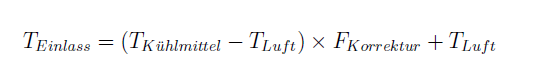

ehbfunctionoverview::CPT_Amf[Component Overview for CPT_Amf]

ehbmodelref::AirMassFlow/Main[AirMassFlow/Main]

Im Modul Luftmassenstrom (AirMassFlow) wird aus dem Saugrohrdruck Mpc_pManiFilt und der Drehzahl Epm_rpmEngSpd die relative Füllung Amf_facRelAir und die Luftmasse pro Absaugung Amf_mAirPerStr berechnet und als Nachricht zur Verfügung gestellt. Die relative Füllung ist die Frischluftmasse im Zylinder unter den dort vorherrschenden Bedingungen relativ zur Frischluftmasse im selben Volumen unter Normbedingungen (Druck von 1013hPa, Temperatur von 273K). Die relative Füllung ist bei Saugmotoren linear vom Saugrohrdruck abhängig, wobei der Restgaspartialdruck berücksichtigt werden muss, da sich der Zylinder beim Auslassen des verbrannten Gemisches aufgrund des Totvolumens nicht vollständig entleert. Gleichung 5.3 beschreibt den Zusammenhang zwischen Saugrohrdruck und relativer Füllung, der in der Kennlinie Amf_pManiEngSpd2facRelAirCorr_MAP hinterlegt ist. Als Grundwert für den Restgaspartialdruck wird 150hPa verwendet. Die Steigung errechnet sich aus dem zweiten Punkt mit 90% bei 1013hPa. Beide Werte entspringen Erfahrungen aus existierenden Motorsteuerungen.

image::amf_png_1.png[]

Das es sich bei dem Smartmotor um einen mit einem Abgasturbolader aufgeladenen Motor handelt muss die Kennlinie noch verifiziert und gegebenenfalls angepasst werden. Über die Kennlinie Amf_rpmEngSpd2facTempCorr_CUR kann bei Bedarf noch eine drehzahlabhängige Korrektur durchgeführt werden. Die Kennlinie ist als Grundwert durchgehend mit Eins gefüllt.

Um den Einfluss der Temperatur zu Berücksichtigen wird der berechnete Basiswert der relativen Füllung mit dem Faktor Amf_facRelAirTempCorr beaufschlagt, der das Verhältnis von Normtemperatur zur Temperatur am Einlass darstellt. Die Temperatur im Zylinder bei Frischluftansaugung wird nicht gemessen und muss daher berechnet werden. Beim Durchströmen des Einlassventils und dem Verteilen im Zylinder erwärmt sich die Luft am Ventil selbst, sowie an den Zylinderwänden, wobei die Drehzahl eine entscheidende Rolle spielt. Sie bestimmt die Zeit, die die Luft hat, um sich zu erwärmen. Zur Abschätzung der Temperatur der Frischluft im Zylinder wird die Differenztemperatur zwischen Kühlmittel Ctc_atCool (quasi Temperatur des Motorblocks) und der Frischluft Mtc_atMani gebildet, mit dem drehzahlabhängigen Faktor Amf_rpmEngSpd2facTempCorr_CUR multipliziert und anschließend die Frischlufttemperatur addiert. Gleichung 5.4 beschreibt den Zusammenhang zur Abschätzung der Frischlufttemperatur Amf_atAirIntake bei Einlass.

Um die abgesaugte Luftmasse pro Hub zu Berechnen wird die Luftmasse unter Normbedingungen berechnet und mit der relativen Füllung multipliziert. Gleichung 5.5 beschreibt den Zusammenhang zur Berechnung der Luftdichte Amf_rohAirDen und daraus der Luftmasse für den Smartmotor.

image::amf_png_3.png[]

Da es sich um in der Regel Konstante Werte handelt, könnte die Normluftmasse auch direkt als Parameter eingehen. Durch die hier gewählte Implementierung zur Berechnung der Normluftmasse ist jedoch die Möglichkeit für schnelle Änderungen geben.

Durch setzen des Flags Amf_flgRelAirOverride kann die relative Füllung für die weiteren Berechnungen manuell durch Amf_facRelAirMan überschrieben werden und durch das Flag Amf_flgAirMassPerStrOverride die Luftmasse pro Absaugung eines Zylinders mit Amf_mAirPerStrMan. Die gesamte Auswertung erfolgt durch die Funktion Amf_calc im Synchron-Raster.

Die Idee, die Luftmassenerfassung in dieser Art umzusetzen, entstammt dem Skript "Engine Control Systems" von Georg Mallebrein.