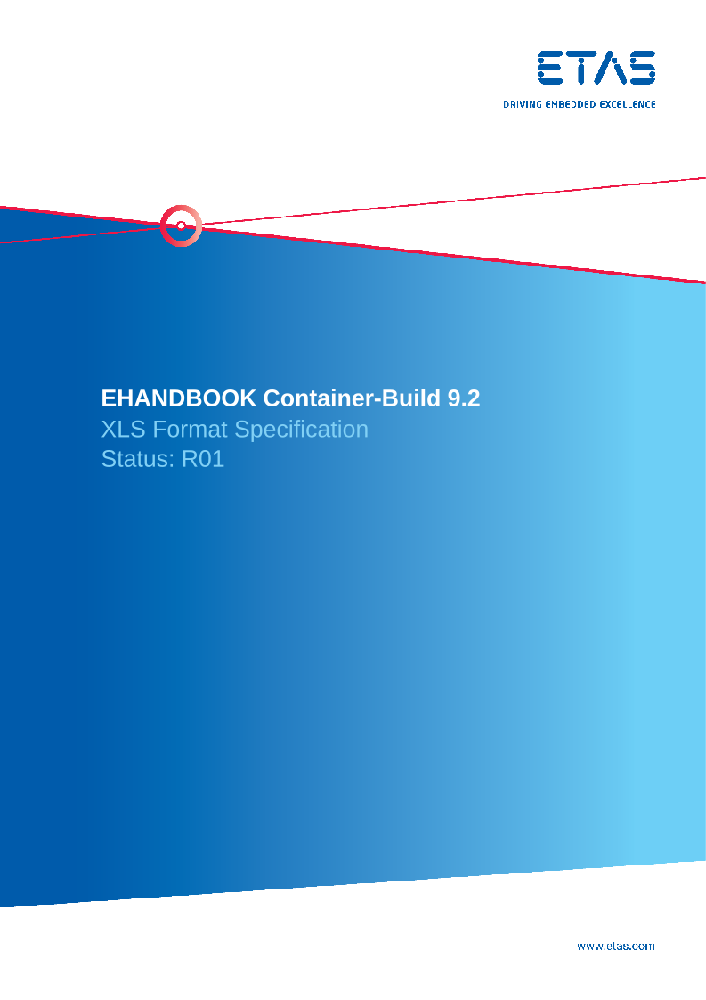
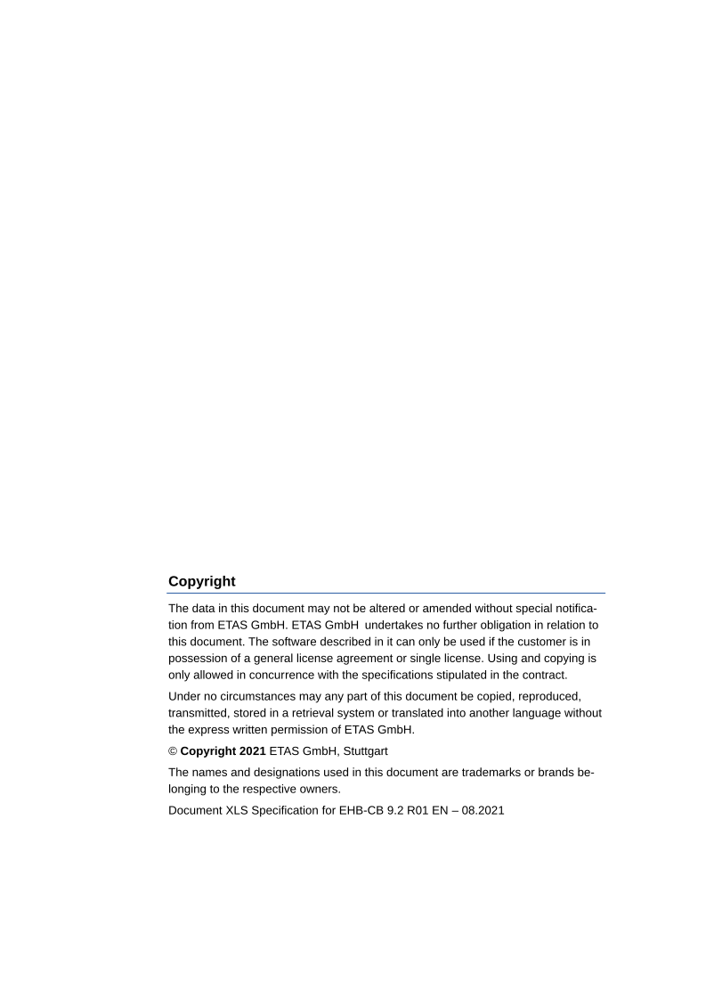
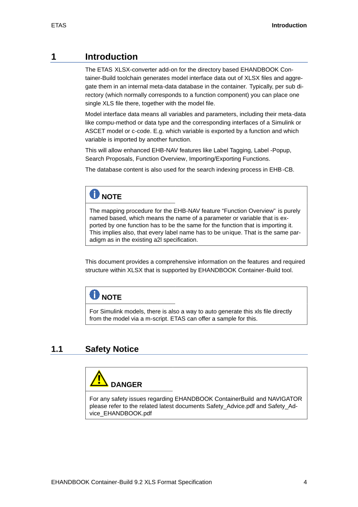
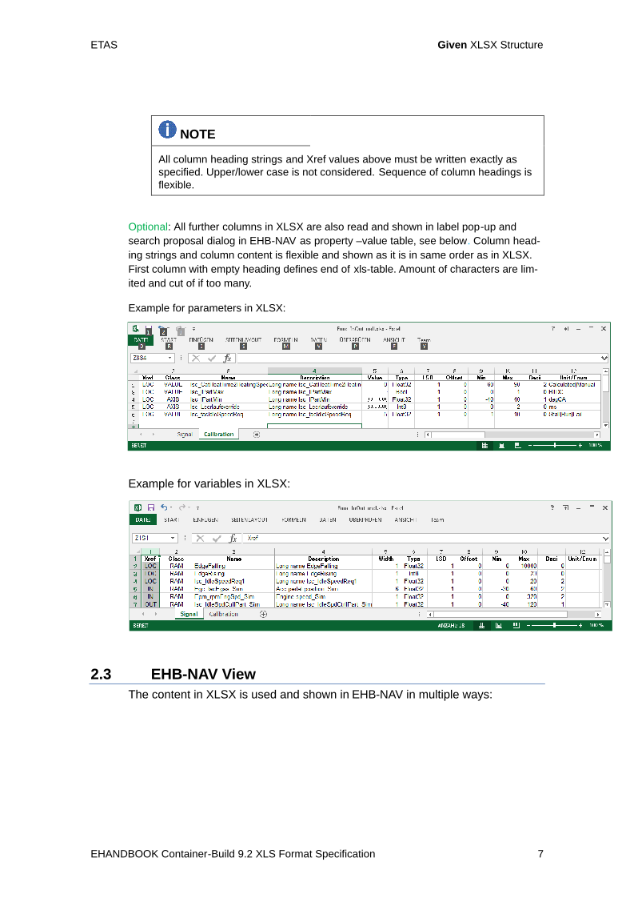
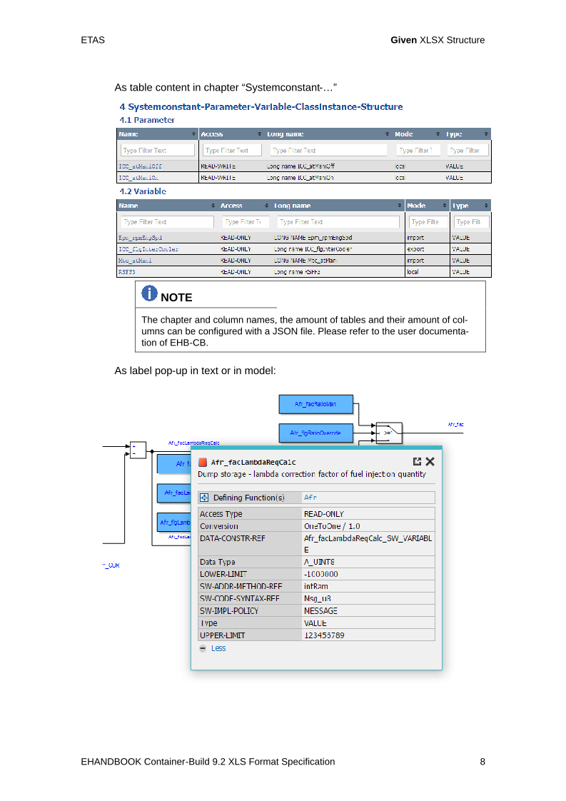
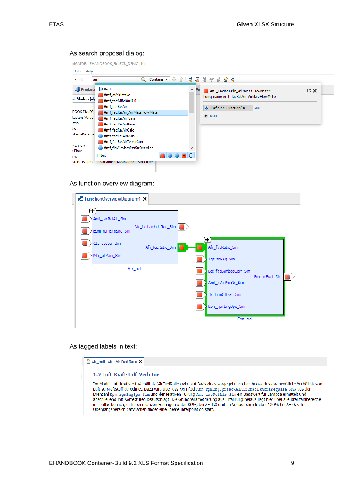

= Function Documentation

== Function Overview 

Here you see the interface of this module:

ehbfunctionoverview::Function_A[Function Overview Function_A] 

== Function Description 

The following model screenshot shows the first level subsystem of the function.

ehbmodelref::Fmc/Fmc_mdl[Fmc/Fmc_mdl] 

== PDF Documentation

Further information from PDF source:

=== Page 1

=== Page 2

=== Page 3

=== Page 4

=== Page 5

=== Page 6

=== Page 7

=== Page 8

=== Page 9

=== Page 10

=== Page 11

