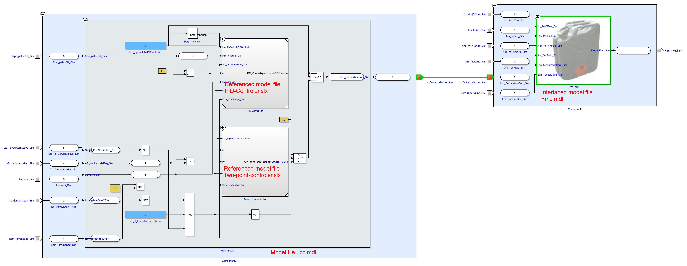

# Demo: Directory-based EHB-CB with Referenced Simulink Models

**Objective:** This demo illustrates how the EHANDBOOK Container-Build processes Simulink models that contain referenced models, ensuring that the complete model hierarchy is correctly represented in the final container.

---

## ✨ Features Showcased

* Directory-based build for a complex Simulink project.
* **Referenced Model Support:** Correct processing of Simulink models that reference other models (`.mdl` or `.slx` files).
* **Simulink Library Support:** Inclusion of external Simulink libraries using the `-simlib` option.

---

## 🛠️ How to Run

1. **Prerequisites:**
    * EHANDBOOK Container-Build with a suitable license for the Simulink converter.
    * Ensure you have run the `set_tool_paths.bat` script in the repository root.

2. **Build:**
    * Open a command prompt or terminal.
    * Navigate to this directory.
    * Execute the `build.bat` script.

---

## 🔬 Explore the Output

* After the build completes, navigate to the `Output/` folder.
* Open the generated EHANDBOOK file.
* Explore the function overview diagrams. You will see that the main components contain blocks that represent the referenced models. You can navigate into these blocks to see the details of the referenced models, just as you would with a native subsystem.

---

## ⚙️ Under the Hood

This demo highlights how EHANDBOOK Container-Build handles modern, component-based Simulink architectures that rely on model referencing.

### Directory Structure

* **`Input/`**: Contains the top-level Simulink models (`Component1` and `Component2`). These models contain "Model" blocks that reference other model files.
* **`simlib/`**: This folder acts as a library, containing the referenced models (`M160_control_lib.mdl`, `M160_lib.mdl`) that the top-level models depend on.
* **`build.bat`**: The script that runs the container build. It uses the `-simlib` argument to tell the builder where to find the referenced models and other libraries.

### Referenced Model Handling

Model referencing is a key Simulink feature for managing large projects and promoting reuse. EHANDBOOK Container-Build fully supports this by:

1. Identifying the "Model" blocks in the top-level components.
2. Searching for the referenced model files in the paths provided (including those specified by `-simlib`).
3. Processing the referenced models and integrating them into the main model's hierarchy.

The result is a seamless, interactive model in the EHANDBOOK container that accurately reflects the complete, multi-file architecture of the original Simulink project.


*A function overview diagram showing a Simulink model that includes two referenced subsystems.*

### Build Script: `build.bat`

```batch
%EHB_CB_PATH%\eHandbookCB.exe ^
-i ".\Input" ^
-o ".\Output" ^
-n "Demo_EHBCB_DirBased_SL_ReferencedModels" ^
-gensvg ^
-simlib ".\simlib,%MATLAB_PATH%\toolbox\simulink" 
```
